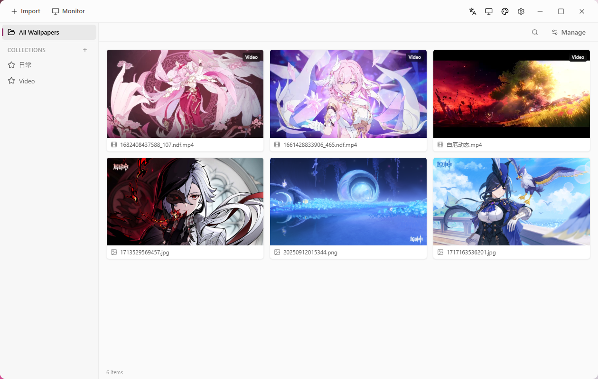
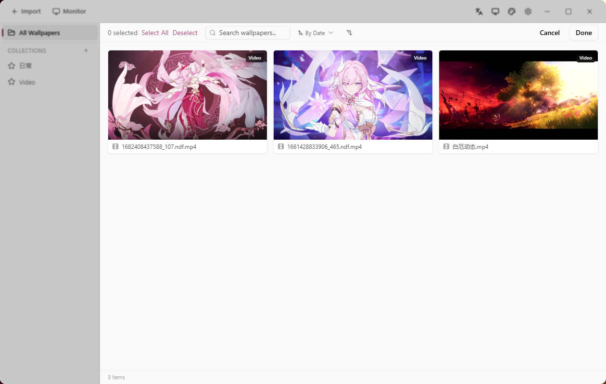
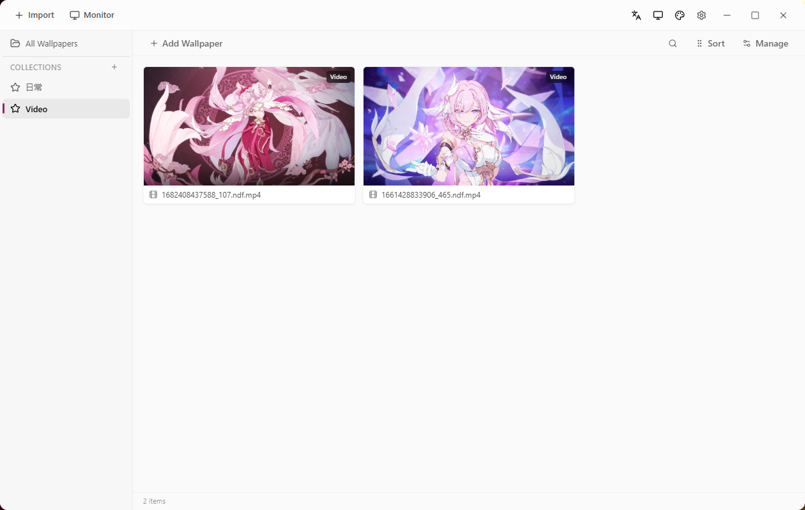
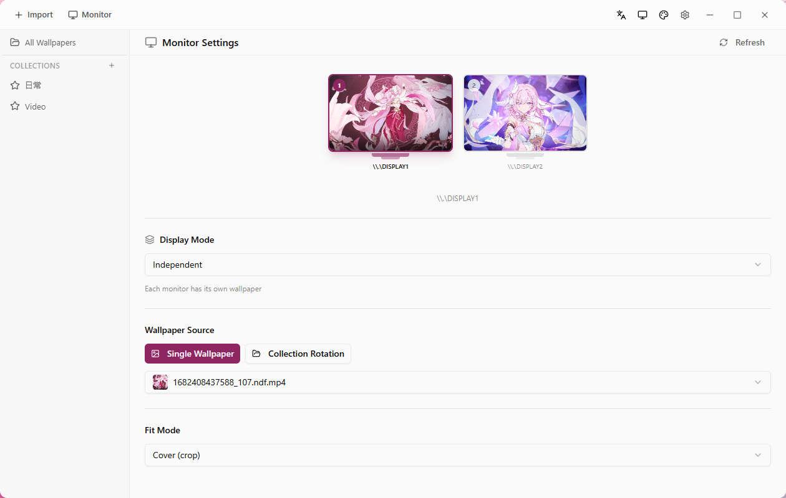

<div align="center">


# Mini Wallpaper

🖼️ A lightweight Windows desktop wallpaper manager

[](LICENSE)
[](https://v2.tauri.app/)
[](https://react.dev/)
[](https://www.typescriptlang.org/)
[](https://www.rust-lang.org/)
[](https://vite.dev/)
[](https://tailwindcss.com/)
[](https://www.sea-ql.org/SeaORM/)

**[简体中文](README-zh.md) | English**

</div>

---

## ✨ Features

- 🖼️ **Local Wallpaper Management** — Import, browse and manage local wallpaper folders
- ⭐ **Favorites** — Add your favorite wallpapers to a collection for quick access
- 🔄 **One-click Wallpaper Switch** — Quickly change desktop wallpaper via global shortcuts
- 🔍 **Smart Sorting & Filtering** — Sort and manage by time, name, and more
- 🖱️ **Drag & Drop Sorting** — Customize wallpaper display order
- 🌐 **Internationalization** — Supports both Chinese and English interfaces
- 🎨 **Custom Themes** — Personalize interface colors
- ⌨️ **Global Shortcuts** — Customizable keyboard shortcuts
- 🚀 **Auto Start** — Launch on system startup (minimized to tray)
- 🪟 **Win11 Style UI** — Modern frosted glass effect interface

---

## 📸 Screenshots

<!-- Add your screenshots here -->

| Main View | Manage View |
|:---:|:---:|
|  |  |

| Favorites | Settings |
|:---:|:---:|
|  |  |

---

## 🛠️ Tech Stack

| Layer | Technology |
|-------|-----------|
| **Framework** | Tauri 2.0 |
| **Frontend** | React 19 + TypeScript 5.8 |
| **Bundler** | Vite 8 |
| **Styling** | Tailwind CSS 4 + Radix UI |
| **State Management** | Zustand |
| **Virtual Scroll** | @tanstack/react-virtual |
| **Backend** | Rust (Edition 2021) |
| **Database** | SQLite + SeaORM |
| **Installer** | NSIS |

---

## 🚀 Getting Started

### Prerequisites

- [Node.js](https://nodejs.org/) >= 22
- [pnpm](https://pnpm.io/) (latest)
- [Rust](https://www.rust-lang.org/tools/install) (stable)
- Windows 10/11

### Install & Run

```bash
# Clone the repository
git clone https://github.com/mi-saka10032/mini-wallpaper.git
cd mini-wallpaper

# Install frontend dependencies
pnpm install

# Run in development mode
pnpm tauri dev

# Build for production
pnpm tauri build
```

---

## 📦 Download

Visit the [Releases](https://github.com/mi-saka10032/mini-wallpaper/releases) page to download the latest installer.

---

## 📄 License

This project is licensed under the [MIT License](LICENSE).

---

<div align="center">

Made with ❤️ by [misaka10032](https://github.com/mi-saka10032)

</div>
