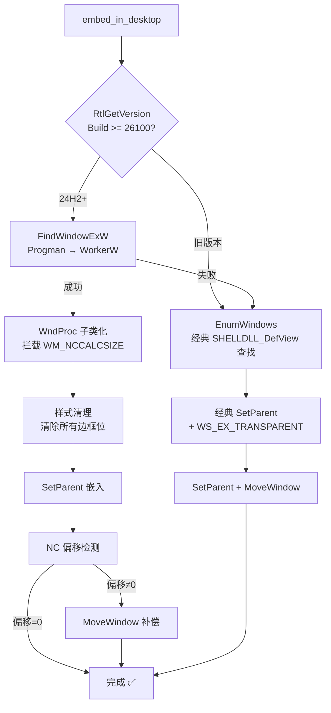

# Desktop Embedder 技术文档

> **模块路径**: `src-tauri/src/platform/windows/desktop_embedder/`
> **最后更新**: 2026-04-25
> **适用系统**: Windows 7 / 8 / 10 / 11（含 24H2 / 25H2）

---

## 一、模块概述

`desktop_embedder` 是 mini-wallpaper 的核心 Win32 模块，负责将 Tauri WebView 窗口嵌入 Windows 桌面壁纸层级，使网页内容作为动态桌面壁纸显示在图标下方。

### 核心原理

```
┌─────────────────────────────────────────┐
│  Windows 桌面窗口层级                     │
│                                         │
│  Progman (桌面管理器)                     │
│    ├── WorkerW (A) ← SHELLDLL_DefView   │
│    │     └── SHELLDLL_DefView           │
│    │           └── SysListView32 (图标)  │
│    └── WorkerW (B) ← 壁纸嵌入目标        │
│          └── Tauri HWND (我们的窗口)      │
└─────────────────────────────────────────┘
```

**嵌入流程**：

1. `FindWindow("Progman")` 找到桌面窗口
2. `SendMessageTimeout(Progman, 0x052C)` 触发 Explorer 创建 WorkerW 分层
3. 根据 Windows 版本选择 WorkerW 查找策略（详见第二节）
4. `SetParent(tauri_hwnd, WorkerW)` 将壁纸窗口嵌入桌面层级

---

## 二、版本兼容策略

### 2.1 版本检测

通过 `RtlGetVersion`（ntdll.dll 导出函数）获取真实的 Windows Build Number，避免被 manifest 兼容性限制影响：

- **Build >= 26100** → 24H2+ 路径
- **Build < 26100** → 旧版本经典路径
- **检测失败** → 安全降级到旧版本路径

### 2.2 桌面窗口层级差异

Windows 11 24H2 改变了桌面窗口层级结构：

```
┌─ 24H2 之前（Win7 ~ Win11 23H2）──────────┐
│                                           │
│  Desktop (顶层)                            │
│    ├── Progman                            │
│    │     └── (原始 SHELLDLL_DefView)       │
│    ├── WorkerW (A) ← 壁纸嵌入目标（顶层）   │
│    └── WorkerW (B) ← SHELLDLL_DefView     │
│          └── SHELLDLL_DefView (被移过来的)  │
│                                           │
│  WorkerW 是顶层窗口，与 Progman 平级        │
│  需要 EnumWindows 遍历查找                  │
└───────────────────────────────────────────┘

┌─ 24H2+（Win11 24H2 / 25H2）──────────────┐
│                                           │
│  Progman                                  │
│    ├── WorkerW ← 壁纸嵌入目标（子窗口）     │
│    └── SHELLDLL_DefView                   │
│          └── SysListView32                │
│                                           │
│  WorkerW 是 Progman 的子窗口               │
│  直接 FindWindowExW(Progman, "WorkerW")    │
└───────────────────────────────────────────┘
```

### 2.3 双路径嵌入策略



| 特性 | 24H2+ 路径 | 旧版本路径 |
|------|-----------|-----------|
| **WorkerW 查找** | `FindWindowExW(Progman, "WorkerW")` | `EnumWindows` + SHELLDLL_DefView |
| **WndProc 子类化** | ✅ 拦截 WM_NCCALCSIZE | ❌ 不需要 |
| **样式清理** | ✅ 清除 WS_CAPTION/THICKFRAME 等 | ❌ 不需要 |
| **WS_EX_LAYERED** | ✅ 需要 | ❌ 不需要 |
| **NC 偏移补偿** | ✅ Fallback 机制 | ❌ 不需要 |
| **鼠标穿透** | ✅ WS_EX_TRANSPARENT（含在样式清理中） | ✅ WS_EX_TRANSPARENT |

---

## 三、最终方案：WndProc 子类化 + NC 补偿（仅 24H2+）

### 第一层：WndProc 子类化拦截 WM_NCCALCSIZE

```
SetParent 触发 WM_NCCALCSIZE
         │
         ▼
  subclass_wndproc 拦截
         │
         ▼
    直接返回 0
  (NC 区域 = 0px)
```

- **时机**：在 `SetParent` 之前完成子类化
- **原理**：替换窗口过程（WndProc），拦截所有 `WM_NCCALCSIZE` 消息并返回 0，告诉系统"不需要任何非客户区"
- **效果**：从根源阻止 24H2/25H2 DWM 注入隐藏的 NC 边框

### 第二层：NC 偏移补偿（Fallback）

嵌入完成后，通过 `GetWindowRect` + `ClientToScreen` 测量实际 NC 偏移：

- 若 NC 偏移为 0 → 方案 A 完全生效，无需补偿
- 若 NC 偏移非 0 → 自动扩大窗口并用负偏移补偿，确保客户区精确覆盖显示器

### 关于 DWM 圆角裁剪（已知限制，选择接受）

Windows 11 DWM 在合成层面强制对窗口施加 ~1px 圆角裁剪，无法通过任何窗口级 API 禁用。

**Overscan 方案已验证后回退**：四边各扩展 1px 虽能消除圆角，但在多显示器场景下，相邻屏幕交接处的 1px 溢出在色差明显的壁纸独立渲染时非常突出。

**最终决策**：接受 1px 圆角溢出——面积更小、更可控，优于多屏交接处的溢出问题。

---

## 四、踩坑历程：方案演进全记录

### 阶段 0：基础嵌入（`85bf168` → `10cb20f`）

**做法**：最基础的 `SetParent` + `MoveWindow` 嵌入。

**问题**：在 Windows 11 24H2 上，`SetParent` 后窗口出现 ~8px 的 NC（非客户区）偏移，壁纸无法完全覆盖屏幕，四边出现缝隙。

---

### 阶段 1：NC Offset 补偿方案（`b0bc6c9` → `943803c` → `fcc3dff`）

**做法**：嵌入后测量 NC 偏移，通过 `MoveWindow` 扩大窗口尺寸并用负坐标补偿。

```rust
let comp_x = target_x - nc_left;
let comp_y = target_y - nc_top;
let comp_w = target_w + nc_left + nc_right;
let comp_h = target_h + nc_top + nc_bottom;
MoveWindow(hwnd, comp_x, comp_y, comp_w, comp_h, 1);
```

**结果**：✅ 基本有效，但属于"治标不治本"——NC 边框依然存在，只是被补偿掉了。

---

### 阶段 2：WM_NCCALCSIZE 拦截（`1fcc143`）— 方案 A 雏形

**做法**：子类化 WndProc，拦截 `WM_NCCALCSIZE` 消息返回 0。

**结果**：✅ 单屏幕下完美消除 NC 偏移！但发现了新问题——窗口左上角和右上角各有一个微小的圆角缺口（~1px），这是 DWM 合成层面的圆角裁剪，与 NC 边框无关。

---

### 阶段 3：DWM 属性尝试（`5f33f65` → `72d6be6` → `c2321dd`）

**尝试禁用 DWM 圆角的各种 API**：

| 尝试 | API | 结果 |
|------|-----|------|
| ① | `DwmSetWindowAttribute(DWMWA_WINDOW_CORNER_PREFERENCE, DONOTROUND)` | ❌ 对子窗口无效 |
| ② | `DwmSetWindowAttribute(DWMWA_NCRENDERING_POLICY, NCRP_DISABLED)` | ❌ 不影响合成层圆角 |
| ③ | `DwmExtendFrameIntoClientArea` | ❌ 无效 |
| ④ | `DwmEnableBlurBehindWindow` | ❌ 无效 |

**结论**：Windows 11 DWM 的圆角裁剪发生在合成管线层面，没有任何单窗口级别的 API 可以禁用。

---

### 阶段 4：Direct Child 方案（`8312433` → `3820d23`）— 重大弯路 ⚠️

**灵感来源**：社区博主提出的方案——不嵌入 WorkerW，而是直接 `SetParent` 到 Progman，配合 Z-order 定时器维持层级。

**做法**：
- `SetParent(tauri_hwnd, Progman)` 直接作为 Progman 的子窗口
- 启动定时器周期性调用 `SetWindowPos` 维持 Z-order

**问题**：
1. ❌ 定时器每次执行都会导致壁纸窗口**高频闪烁**（每次重设 Z-order 都触发重绘）
2. ❌ 多显示器场景下出现 8px 缝隙（与 NC offset 问题本质相同）
3. ❌ Z-order 方案在 25H2 上不稳定

**教训**：这个方向完全走偏了，浪费了大量时间。Direct Child 方案不适用于 25H2。

---

### 阶段 5：回退 + 频闪修复（`8c5e2ce` → `910677a` → `d3ae3ef`）

**做法**：回退到阶段 2 的 WndProc 子类化方案，同时修复了定时器频闪问题。

**频闪根因**：定时器每次执行都无条件调用 `SetWindowPos` 重设 Z-order，即使层级已经正确。

**修复**：在定时器回调中先检查当前 Z-order 是否正确，只在不正确时才调整。

---

### 阶段 6：前端 CSS 补偿（`31a7bd5`）— 方案 B

**做法**：不在 Win32 层补偿 NC offset，而是通过前端 CSS `margin` 负值来补偿。

**结果**：❌ 失败。WebView 的渲染区域受限于窗口客户区，CSS 负 margin 无法突破窗口边界。

---

### 阶段 7：Win32 层 NC 补偿（`0daf066`）— 方案 C

**做法**：回到 Win32 层，在 `SetParent` 后设置 `WS_CHILD` 样式，尝试彻底消除 NC offset。

**结果**：❌ 多显示器场景下 8px 缝隙依然存在，只是从一个屏幕跑到另一个屏幕。

---

### 阶段 8：WS_CHILD 前置 + 完整样式清理（`e0ee0b4`）

**做法**：在 `SetParent` 后立即设置 `WS_CHILD`，并清理所有边框相关样式位。

**结果**：❌ 多屏 8px 缝隙问题依旧，缝隙在两个屏幕之间"漂移"。

---

### 阶段 9：DWM 圆角消除专项攻坚（`9535183` → `a07b144` → `de9b935`）

回退到方案 A（WndProc 子类化）后，专注解决剩余的圆角问题：

| 提交 | 方案 | 结果 |
|------|------|------|
| `9535183` | `DWMWA_WINDOW_CORNER_PREFERENCE = DONOTROUND` | ❌ 对子窗口无效 |
| `a07b144` | `SetWindowRgn` 强制矩形区域 | ❌ 被 DWM 合成管线忽略 |
| `de9b935` | **Overscan 方案**：四边各扩展 8px | ⚠️ 圆角消除了，但多屏交接处出现 16px 重叠 |

---

### 阶段 10：Overscan 精细化 → 最终回退（`ec9c6eb` → `9f21eb6` → 当前版本）

**演进过程**：

1. `ec9c6eb`：精细化 overscan，仅顶部+左右扩展 1px → 效果不理想
2. `9f21eb6`：`DWM_CORNER_RADIUS` 从 8 降到 1，四边各扩展 1px → 多屏交接处仍有 ~2px 溢出
3. **当前版本**：**完全回退 Overscan 方案**

**回退原因**：1px 的边缘溢出在两张色差明显的壁纸独立渲染时差异非常明显，相比之下 1px 圆角溢出面积更小、更可控。

---

### 阶段 11：版本兼容（当前版本）

**新增**：`is_win11_24h2_or_later()` 版本检测函数，通过 `RtlGetVersion` 获取真实 Build Number。

**改动**：
- 24H2+（Build >= 26100）：走完整的 WndProc 子类化 + 样式清理 + NC 补偿路径
- 旧版本（< 24H2）：走经典 `EnumWindows` + 简单 `SetParent` 路径，无需额外修复
- 24H2+ 的 WorkerW 查找失败时，自动 fallback 到经典 `EnumWindows` 方案

---

## 五、关键结论

### 5.1 Windows 11 24H2/25H2 的两个独立问题

| 问题 | 根因 | 解决方案 | 状态 |
|------|------|----------|------|
| **NC 偏移（~8px）** | `SetParent` 后 DWM 通过 `WM_NCCALCSIZE` 注入隐藏 NC 边框 | WndProc 子类化拦截 `WM_NCCALCSIZE` 返回 0 | ✅ 已解决 |
| **圆角裁剪（~1px）** | DWM 合成管线强制施加圆角，无窗口级 API 可禁用 | 选择接受（Overscan 方案已验证后回退） | ⚠️ 已知限制 |

这两个问题**必须分别处理**，混淆它们是导致多次走弯路的主要原因。

### 5.2 已验证无效的方案

| 方案 | 原因 |
|------|------|
| `DWMWA_WINDOW_CORNER_PREFERENCE` | 对 `WS_CHILD` 子窗口无效 |
| `DWMWA_NCRENDERING_POLICY` | 不影响合成层圆角 |
| `SetWindowRgn` | 被 DWM 合成管线忽略 |
| `DwmExtendFrameIntoClientArea` | 对嵌入式子窗口无效 |
| Direct Child (Progman) + Z-order 定时器 | 高频闪烁 + 25H2 不稳定 |
| 前端 CSS 补偿 | WebView 渲染区域受限于窗口客户区 |
| Overscan 四边扩展 | 消除圆角但多屏交接处溢出在色差壁纸下非常明显 |

### 5.3 已知限制

1. **DWM 圆角（~1px）**：窗口左上角和右上角各有约 1px 的圆角裁剪，这是 DWM 合成管线的强制行为，截至 Win11 25H2 无任何 API 可禁用。选择接受此限制。
2. **旧版本未实测**：24H2 之前的经典路径基于社区成熟方案实现，但未在实际旧版本系统上验证。版本检测失败时安全降级到经典路径。

---

## 六、代码架构

### 6.1 设计模式：策略模式（Strategy Pattern）

重构后采用策略模式封装不同 Windows 版本的嵌入行为差异：

```
┌─────────────────────────────────────────────────────┐
│                  EmbedStrategy trait                  │
│  ┌───────────────────────────────────────────────┐  │
│  │  + name() -> &str                             │  │
│  │  + find_workerw(progman) -> Result<HWND>      │  │
│  │  + embed(hwnd, workerw, rect) -> Result<()>   │  │
│  └───────────────────┬───────────────────────────┘  │
│                      │                               │
│          ┌───────────┴───────────┐                   │
│          │                       │                   │
│  ┌───────┴───────┐   ┌──────────┴──────────┐       │
│  │ ModernStrategy │   │  LegacyStrategy     │       │
│  │  (24H2+)      │   │  (Win7~Win11 23H2)  │       │
│  │               │   │                     │       │
│  │ • WndProc 子类化│   │ • 简单 SetParent    │       │
│  │ • 样式清理     │   │ • WS_EX_TRANSPARENT │       │
│  │ • NC 补偿      │   │ • MoveWindow        │       │
│  └───────────────┘   └─────────────────────┘       │
│                                                      │
│  select_strategy() → 根据版本自动选择                  │
└─────────────────────────────────────────────────────┘
```

### 6.2 日志与错误处理

| 组件 | 方案 | 说明 |
|------|------|------|
| **日志** | `log` + `env_logger` | Rust 标准日志门面，通过 `RUST_LOG` 环境变量控制级别 |
| **错误处理** | `anyhow` | 应用级错误处理，支持 `.context()` 错误链和 `bail!` 宏 |

日志级别使用规范：
- `error!` — 嵌入失败等不可恢复错误
- `warn!` — 降级路径、子类化槽位不足等可恢复异常
- `info!` — 版本检测结果、嵌入完成、策略选择等关键流程
- `debug!` — WndProc 替换地址、子类化槽位分配等调试信息

### 6.3 文件结构

```
desktop_embedder/
│
├── mod.rs        — 公共 API 入口
│   ├── encode_wide()            — UTF-8 → UTF-16 编码辅助
│   ├── embed_in_desktop()       — 嵌入桌面（公共 API）
│   └── unembed_from_desktop()   — 解除嵌入（公共 API）
│
├── strategy.rs   — 策略接口 + 共享类型 + 策略选择工厂
│   ├── EmbedStrategy trait      — 嵌入策略接口（name / find_workerw / embed）
│   ├── MonitorRect              — 显示器矩形区域值对象
│   └── select_strategy()        — 策略选择工厂函数
│
├── modern.rs     — ModernStrategy（24H2+ 嵌入策略）
│   ├── ModernStrategy           — WndProc 子类化 + 样式清理 + NC 补偿
│   ├── NcOffset                 — NC 偏移测量结果（仅 Modern 使用）
│   └── measure_nc_offset()      — 测量窗口 NC 偏移（仅 Modern 使用）
│
├── legacy.rs     — LegacyStrategy（旧版本嵌入策略）
│   └── LegacyStrategy           — 经典 SetParent + WS_EX_TRANSPARENT + MoveWindow
│
├── wndproc.rs    — WndProc 子类化基础设施（仅 ModernStrategy 使用）
│   ├── ORIGINAL_WNDPROCS[8]     — 原始 WndProc 全局槽位（支持最多 8 显示器）
│   ├── SUBCLASSED_HWNDS[8]      — 对应 HWND 全局槽位
│   ├── register_subclass()      — 注册子类化信息到空闲槽位
│   └── subclass_wndproc()       — 替换的窗口过程（拦截 WM_NCCALCSIZE 返回 0）
│
├── version.rs    — Windows 版本检测
│   └── is_win11_24h2_or_later() — RtlGetVersion 检测 Build >= 26100
│
└── workerw.rs    — 经典 WorkerW 查找
    └── find_workerw_classic()   — EnumWindows + SHELLDLL_DefView 方案
```

**设计原则**：
- 每个文件只包含一个职责，代码量控制在 45~170 行
- `mod.rs` 作为对外门面，仅暴露 `embed_in_desktop()` 和 `unembed_from_desktop()`
- `strategy.rs` 定义策略接口和共享类型，与具体实现解耦
- `NcOffset` / `measure_nc_offset` 仅 `modern.rs` 使用，作为文件私有类型不对外暴露
- 内部模块间通过 `pub(super)` 可见性控制，外部无法直接访问策略实现
- 非 Windows 平台的空实现已移除（整个模块位于 `platform/windows/` 下，由调用方 `#[cfg]` 控制）

---

## 七、Git 提交时间线

```
85bf168  feat: init
10cb20f  feat: embed（基础嵌入）
b0bc6c9  fix: 24h2 offset（发现 NC 偏移问题）
4a568bf  fix: rewrite NC offset compensation
943803c  fix: temp nc_offset
fcc3dff  fix: preclean nc_offset
1fcc143  fix: WM_NCCALCSIZE interception（方案 A 雏形 ⭐）
5f33f65  dwm disabled
72d6be6  disabled radius
c2321dd  fix: corner_disabled
71feb2b  fix: border
8312433  refactor: Direct Child approach（重大弯路 ⚠️）
4bb5df2  fix: Direct Child HWND null checks
b338cd0  fix: hybrid embed strategy
3820d23  refactor: switch to Direct Child（基于博客方案）
032757a  fix: replace DWM imports with raw FFI
1d2be70  fix: enhance for 25H2 compatibility
af3e46d  fix: NC offset + DwmSetWindowAttribute
31a7bd5  feat: 方案 B - 前端 CSS 补偿（❌ 失败）
0daf066  feat: 方案 C - Win32 NC 补偿 + 频闪修复
e0ee0b4  fix: WS_CHILD 消除 NC offset（❌ 多屏缝隙）
8c5e2ce  revert: 回退到 NC offset 补偿方案
910677a  revert: 回退到 WndProc 子类化方案
d3ae3ef  revert: 回退到方案 A（⭐ 确认最优基线）
9535183  fix: DWMWA_WINDOW_CORNER_PREFERENCE（❌ 无效）
a07b144  fix: SetWindowRgn 强制矩形（❌ 无效）
de9b935  fix: Overscan 方案（8px 版本）
ec9c6eb  fix: 精细化 overscan（仅顶部+左右）
7beb4a7  Revert 精细化 overscan
9f21eb6  feat: DWM_CORNER_RADIUS: 1（Overscan 1px 版本）
         ↓ 回退 Overscan + 增加版本兼容
         ↓ refactor: 策略模式 + log 日志 + anyhow 错误处理
         ↓ refactor: 模块拆分为 desktop_embedder/ 目录（当前版本 ⭐）
```

---

## 八、代码质量改进记录

### 8.1 策略模式重构（2026-04-25）

**动机**：原始代码在 `embed_in_desktop()` 中通过 `if is_24h2 { ... } else { ... }` 大段分支处理两种嵌入路径，函数体超过 200 行，可读性差。

**改进**：
- 引入 `EmbedStrategy` trait，定义 `name()`、`find_workerw()`、`embed()` 三个接口
- `ModernStrategy`（24H2+）和 `LegacyStrategy`（旧版本）分别实现
- `select_strategy()` 工厂函数根据版本自动选择
- `embed_in_desktop()` 简化为：找 Progman → 触发 WorkerW → 选策略 → 执行

### 8.2 日志系统（2026-04-25）

**动机**：全项目使用 `println!` 输出日志，无级别控制、无模块信息、无运行时过滤能力。

**改进**：
- 引入 `log`（门面）+ `env_logger`（后端）
- 所有 `println!` → `info!`/`warn!`/`debug!`/`error!`
- 通过 `RUST_LOG` 环境变量运行时控制日志级别
- 模块名由 `log` 自动附加，不再需要手动写 `[DesktopEmbedder]` 前缀

### 8.3 错误处理（2026-04-25）

**动机**：错误类型为 `Result<(), String>`，无错误链、无上下文信息、调试困难。

**改进**：
- `desktop_embedder` 模块返回 `anyhow::Result<()>`
- 使用 `bail!` 替代 `Err("...".into())`
- 使用 `.context()` 为错误附加上下文链
- 调用方通过 `{:#}` 格式化输出完整错误链

### 8.4 模块拆分（2026-04-25）

**动机**：单文件 588 行，混合了策略 trait、两种策略实现、WndProc 子类化、版本检测、WorkerW 查找等不同职责，阅读和维护困难。

**改进**：
- 拆分为 `desktop_embedder/` 目录模块，7 个文件各司其职
- 每个文件 45~170 行，职责单一、易于阅读
- `mod.rs` 精简为纯粹的公共 API 入口，不包含任何策略/类型定义
- 新增 `strategy.rs` 存放 `EmbedStrategy` trait、`MonitorRect`、`select_strategy()` 工厂函数
- `NcOffset` / `measure_nc_offset()` 下沉到 `modern.rs` 作为文件私有类型（仅 ModernStrategy 使用）
- 内部模块通过 `pub(super)` 可见性控制
- 删除非 Windows 平台的冗余空实现（整个模块已在 `platform/windows/` 下）

---

## 九、后续优化方向

1. **旧版本实测验证**：在 Win10 / Win11 23H2 等旧版本上验证经典嵌入路径的正确性
2. **监听 DPI 变化**：当用户切换显示器缩放比例时，可能需要重新嵌入
3. **监听显示器热插拔**：多显示器拓扑变化时需要重新执行嵌入流程
4. **DWM 圆角持续关注**：关注微软后续版本是否提供新的 API 来禁用子窗口的 DWM 圆角裁剪
